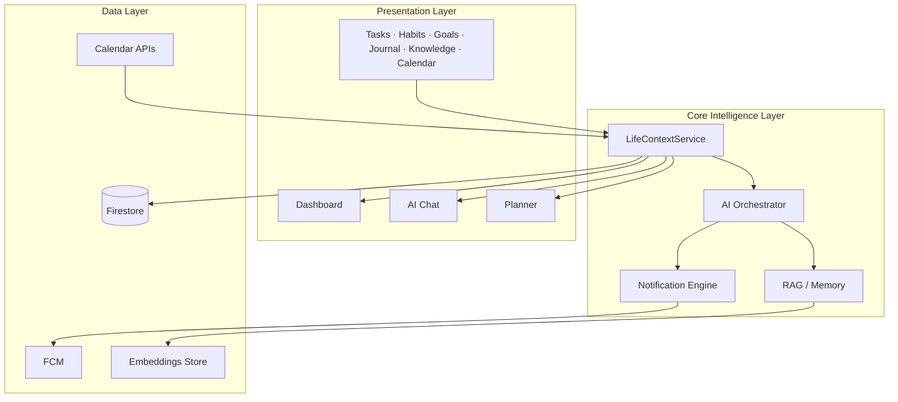

# Full Development Plan — AI Life Operating System

## North Star

Every day, the app answers one question:

> **"What is the best thing I should do right now to get closer to my goals?"**

Success = measurable progress toward goals, not busyness.

---

## Current State (Today)

### Done — Foundation

| Area | Status | Notes |
|------|--------|-------|
| Architecture | ✅ | Feature-first clean architecture, Riverpod 3, GoRouter |
| Auth | ✅ | Email/password + Google Sign-In, session restore, forgot-password flow |
| Onboarding | ✅ | 5-step profile setup (schedule, focus goal) |
| Tasks | ✅ | CRUD, priority, status, due dates, `goalId` field + goal picker UI |
| Habits | ✅ | CRUD, streaks, today toggle |
| Goals | ✅ | CRUD, hierarchy enums, categories, progress field, edit/delete |
| Journal | ✅ | Mood, energy, wins, lessons, reflections |
| Knowledge | ✅ | Notes with tags (Firestore) |
| Planner | ✅ | Gemini 5-stage pipeline + deterministic fallback, goal-aware prompts |
| AI Chat | ✅ | Gemini with life context injection |
| Dashboard | ✅ | Chief of Staff home, top recommendation card, goal list (basic) |
| Life Context | ✅ | Unified snapshot for planner, chat, dashboard |
| Navigation | ✅ | 6-tab shell (Dashboard · Goals · Tasks · Habits · Plan · AI) |
| Security | ✅ | API key via `--dart-define` only |

### Partial — Needs Completion

| Area | Gap |
|------|-----|
| Settings | All toggles are static/non-functional (AI model, notifications) |
| Knowledge | No search or tag filter UI; no edit note flow |
| Tests | No test files in the project |

### Missing — Not Started

| Area | Notes |
|------|-------|
| Calendar | No calendar feature folder; `BusyTimeBlock` entity exists in planner context only |
| Analytics | No feature folder, no charts |
| Notifications / FCM | No notification service, no push setup |
| Focus sessions / Pomodoro | No files anywhere |
| AI conversation memory | Chat persisted, but no summarization for context |
| RAG over knowledge base | No embedding store or vector search |
| iOS platform config | Unverified |
| Tests | No test files in the project |

---

## Target Architecture



### Core Principle

One **`LifeContext`** object feeds every AI surface. No feature talks to Gemini directly without it.

```
LifeContext
├── profile (schedule, preferences)
├── activeGoals (vision → daily hierarchy)
├── pendingTasks (priority-sorted, goal-linked)
├── todayHabits (streak risk flagged)
├── plannerSessions (current + next)
├── latestJournal (mood, energy)
├── calendarBlocks (busy time)
├── inferredEnergy
├── topRecommendation
└── toPromptContext() / toPlannerContext()
```

---

## Phased Roadmap

### Phase 0 — Stabilize
*Make what exists reliable before adding features.*

| # | Task | Why | Status |
|---|------|-----|--------|
| 0.1 | Wire forgot-password flow | Auth incomplete | ✅ Done |
| 0.2 | Add goal edit/delete UI | Goals were read-only after create | ✅ Done |
| 0.3 | Add settings link in nav or dashboard | Settings unreachable from shell | ✅ Done — added to QuickActionsCard |
| 0.4 | Persist AI chat to Firestore | Conversations lost on restart | ✅ Done — already implemented |
| 0.5 | Add controller/widget tests for LifeContext + planner | Prevent regressions | ❌ Not done |

**Exit criteria:** All CRUD flows work end-to-end; chat survives app restart; settings reachable. ✅ COMPLETE (except tests)

---

### Phase 1 — Goal-Aligned Core
*Every task and recommendation traces to a goal.*

| # | Task | Details | Status |
|---|------|---------|--------|
| 1.1 | **Goal hierarchy UI** | Tree/list view: Vision → Long-term → Quarterly → Monthly → Weekly → Daily | ✅ Done — tree widget with expand/collapse + parent picker in dialog |
| 1.2 | **Goal detail page** | Progress slider, linked tasks, child goals, target date | ✅ Done — full detail page with all features |
| 1.3 | **Goal picker on tasks** | Dropdown on add/edit task; filter tasks by goal | ✅ Done — `goalId` dropdown in both AddTaskPage and EditTaskPage |
| 1.4 | **Auto progress from tasks** | Goal progress = completed linked tasks / total linked tasks | ✅ Done — TaskController calls GoalController on add/delete/toggle |
| 1.5 | **Goal-aware planner prompts** | Gemini prompt includes goal hierarchy + "why this session matters" | ✅ Done — `LifeContext.activeGoals` injected into planner prompt |
| 1.6 | **Dashboard goal progress cards** | Replace placeholder projects with real goal progress rings | ✅ Done — circular progress rings with color coding |
| 1.7 | **Weekly goal review flow** | AI-generated weekly summary from goal + task + habit data | ✅ Done — full WeeklyReviewPage with Gemini insights |

**Exit criteria:** User can create a vision goal, break it into weekly goals, link tasks, and see progress on dashboard. ✅ COMPLETE

---

### Phase 2 — Calendar & Time Reality
*Planner respects real-world commitments.*

| # | Task | Details | Status |
|---|------|---------|--------|
| 2.1 | **Calendar feature module** | `calendar_event_entity`, Firestore CRUD, daily/weekly views | ❌ Not started |
| 2.2 | **Manual event creation** | Title, start/end, flexible flag, recurrence (basic) | ❌ Not started |
| 2.3 | **Wire `busyTimeBlocks` into LifeContext** | Populate from calendar events | ❌ Not started |
| 2.4 | **Time-blocked planner UI** | Visual timeline with fixed blocks + AI sessions | ❌ Not started |
| 2.5 | **Google Calendar sync (read-only)** | `googleapis` + OAuth; import events as busy blocks | ❌ Not started |
| 2.6 | **Conflict detection** | Warn when planner session overlaps fixed event | ❌ Not started |
| 2.7 | **Available time calculator** | Show "you have X free hours today" on dashboard | ❌ Not started |

**Exit criteria:** Planner never schedules over fixed calendar events; user sees accurate free time.

---

### Phase 3 — Intelligent Feedback Loops
*Journal, habits, and performance improve AI decisions.*

| # | Task | Details | Status |
|---|------|---------|--------|
| 3.1 | **Energy-aware scheduling** | Low energy → light tasks first; high energy → deep work | ❌ Not started |
| 3.2 | **Mood trend tracking** | 7-day mood/energy chart on journal page | ❌ Not started |
| 3.3 | **Habit pattern detection** | Best completion times, missed-day patterns | ❌ Not started |
| 3.4 | **Streak-at-risk nudges** | In-app banner when habit streak is about to break | ❌ Not started |
| 3.5 | **Plan failure detection** | If session skipped/overdue → suggest replan | ❌ Not started |
| 3.6 | **One-tap replan** | "I'm behind" button triggers `fitIntoAvailableTimeFromContext` | ❌ Not started |
| 3.7 | **End-of-day reflection prompt** | Evening notification → journal entry | ❌ Not started |

**Exit criteria:** AI adapts schedule based on energy; user gets replan suggestions when falling behind.

---

### Phase 4 — Proactive AI & Memory
*Assistant remembers and initiates, not just responds.*

| # | Task | Details | Status |
|---|------|---------|--------|
| 4.1 | **Chat persistence** | `users/{uid}/conversations/{id}/messages` in Firestore | ❌ Not started |
| 4.2 | **Conversation memory** | Summarize past chats; inject summary into LifeContext | ❌ Not started |
| 4.3 | **Proactive morning briefing** | Dashboard card: "Today's focus, risks, and opportunities" | ❌ Not started |
| 4.4 | **AI insight generation** | Daily Gemini call → populate `AiInsightCard` with reasoning | ❌ Not started |
| 4.5 | **Suggested actions from chat** | AI proposes task/habit/goal changes user can accept | ❌ Not started |
| 4.6 | **Knowledge RAG** | Embed notes → vector search → inject relevant notes into prompts | ❌ Not started |
| 4.7 | **Cloud Functions for AI** | Move Gemini calls server-side (key security, rate limiting) | ❌ Not started |

**Exit criteria:** AI remembers past conversations; morning briefing is personalized; notes surface in chat answers.

---

### Phase 5 — Notifications & Engagement

| # | Task | Details | Status |
|---|------|---------|--------|
| 5.1 | **Firebase Cloud Messaging setup** | `firebase_messaging` package, token storage | ❌ Not started |
| 5.2 | **Habit reminders** | Scheduled based on profile + habit frequency | ❌ Not started |
| 5.3 | **Session start nudges** | "Your deep work block starts in 5 min" | ❌ Not started |
| 5.4 | **Goal deadline warnings** | 3-day / 1-day / overdue alerts | ❌ Not started |
| 5.5 | **Replan suggestions** | "You missed 2 sessions — replan?" | ❌ Not started |
| 5.6 | **Notification preferences** | Working toggles in Settings; quiet hours | ❌ Not started |
| 5.7 | **Smart throttling** | Max N notifications/day; batch related nudges | ❌ Not started |

**Exit criteria:** User receives timely, non-spammy nudges aligned with goals.

---

### Phase 6 — Analytics & Insights

| # | Task | Details | Status |
|---|------|---------|--------|
| 6.1 | **Analytics feature module** | Aggregated stats from tasks, habits, planner, journal | ❌ Not started |
| 6.2 | **Goal progress dashboard** | Charts per goal level and category | ❌ Not started |
| 6.3 | **Habit consistency heatmap** | GitHub-style contribution grid | ❌ Not started |
| 6.4 | **Time allocation breakdown** | Study vs habit vs break vs missed | ❌ Not started |
| 6.5 | **Planning accuracy score** | Planned vs completed sessions ratio | ❌ Not started |
| 6.6 | **Focus time tracking** | Total deep work minutes per day/week | ❌ Not started |
| 6.7 | **Weekly AI report** | Gemini-generated narrative of the week | ❌ Not started |

**Exit criteria:** User sees where time goes and whether they're making goal progress.

---

### Phase 7 — Polish & Life OS Expansion (ongoing)

| # | Task | Details | Status |
|---|------|---------|--------|
| 7.1 | **Focus session mode** | Full-screen timer linked to planner session | ❌ Not started |
| 7.2 | **Themes & appearance** | Light/dark/system + accent colors in Settings | ❌ Not started |
| 7.3 | **Profile editing** | Post-onboarding schedule/preference changes | ❌ Not started |
| 7.4 | **Data export/backup** | JSON export of all user data | ❌ Not started |
| 7.5 | **Offline support** | Firestore persistence + sync queue | ❌ Not started |
| 7.6 | **Knowledge search & tags** | Full-text search, tag filtering, edit note | ❌ Not started |
| 7.7 | **Ideas inbox** | Quick capture → triage to task/goal/note | ❌ Not started |
| 7.8 | **Finance module** | Budget tracking linked to finance goals (future) | ❌ Not started |
| 7.9 | **Multi-device sync** | Real-time Firestore listeners everywhere | ❌ Not started |
| 7.10 | **App Store / Play Store release** | iOS + Android builds, privacy policy | ❌ Not started |

---

## Feature Specification Reference

### AI Assistant
| Capability | Phase | Status |
|------------|-------|--------|
| Context-aware chat | ✅ Done | ✅ |
| Life context injection | ✅ Done | ✅ |
| Chat persistence | Phase 4 | ❌ |
| Conversation memory | Phase 4 | ❌ |
| Proactive briefings | Phase 4 | ❌ |
| Suggested actions (create task from chat) | Phase 4 | ❌ |
| Knowledge RAG retrieval | Phase 4 | ❌ |

### Goal Management
| Capability | Phase | Status |
|------------|-------|--------|
| CRUD + enums | ✅ Done | ✅ |
| Hierarchy UI (parent/child tree) | Phase 1 | ❌ |
| Goal detail page | Phase 1 | ❌ |
| Auto progress from tasks | Phase 1 | ❌ |
| Task linkage UI (goal picker) | ✅ Done | ✅ |
| Weekly review (AI-generated) | Phase 1 | ⚠️ Basic dialog only |
| Dashboard progress rings | Phase 1 | ⚠️ Name + tag only |

### Smart Planning
| Capability | Phase | Status |
|------------|-------|--------|
| Gemini 5-stage pipeline | ✅ Done | ✅ |
| Goals + energy in context | ✅ Done | ✅ |
| Calendar busy blocks | Phase 2 | ❌ |
| Auto-replan on failure | Phase 3 | ❌ |
| Multi-day planning | Phase 7 | ❌ |
| Focus session integration | Phase 7 | ❌ |

### Task Management
| Capability | Phase | Status |
|------------|-------|--------|
| CRUD + priority + status | ✅ Done | ✅ |
| Goal picker (add + edit) | ✅ Done | ✅ |
| Dependencies | Phase 7 | ❌ |
| AI reorder on context change | Phase 3 | ❌ |
| Progress/subtasks | Phase 7 | ❌ |

### Habit Tracking
| Capability | Phase | Status |
|------------|-------|--------|
| CRUD + streaks | ✅ Done | ✅ |
| Pattern detection | Phase 3 | ❌ |
| AI improvement suggestions | Phase 3 | ❌ |
| Streak-at-risk alerts | Phase 3 | ❌ |

### Calendar
| Capability | Phase | Status |
|------------|-------|--------|
| Entity (`BusyTimeBlock` in planner context) | ✅ Done | ✅ |
| Manual event CRUD + views | Phase 2 | ❌ |
| Google Calendar sync | Phase 2 | ❌ |
| Time blocking UI | Phase 2 | ❌ |

### Journal & Reflection
| Capability | Phase | Status |
|------------|-------|--------|
| Full CRUD | ✅ Done | ✅ |
| Energy → planner | ✅ Done | ✅ |
| Mood trends | Phase 3 | ❌ |
| End-of-day prompts | Phase 3 | ❌ |
| AI uses reflections | Phase 4 | ❌ |

### Analytics
| Capability | Phase | Status |
|------------|-------|--------|
| All metrics | Phase 6 | ❌ |

### Notifications
| Capability | Phase | Status |
|------------|-------|--------|
| FCM + all nudge types | Phase 5 | ❌ |

### Knowledge
| Capability | Phase | Status |
|------------|-------|--------|
| Notes CRUD (add + delete) | ✅ Done | ✅ |
| Edit note | Phase 7 | ❌ |
| Search + tag filter UI | Phase 7 | ❌ |
| RAG for AI | Phase 4 | ❌ |

### Settings
| Capability | Phase | Status |
|------------|-------|--------|
| Account display + sign out | ✅ Done | ✅ |
| Settings reachable from nav | Phase 0 | ⚠️ Page exists; no nav link |
| AI preferences (functional) | Phase 5 | ❌ |
| Themes | Phase 7 | ❌ |
| Privacy + data export | Phase 7 | ❌ |
| Notification prefs | Phase 5 | ❌ |

---

## Firestore Schema (Target)

```
users/{uid}
  ├── profile fields
  ├── tasks/{taskId}
  ├── habits/{habitId}
  ├── goals/{goalId}
  ├── journals/{journalId}
  ├── notes/{noteId}
  ├── calendar_events/{eventId}          ← Phase 2
  ├── conversations/{convId}/messages/{}  ← Phase 4
  ├── embeddings/{noteId}                 ← Phase 4
  ├── planner/{yyyy-MM-dd}/sessions/{id}
  ├── analytics/daily/{yyyy-MM-dd}       ← Phase 6
  └── settings/preferences               ← Phase 5
```

---

## Tech Additions by Phase

| Phase | New Packages / Services |
|-------|-------------------------|
| 2 | `googleapis`, `extension_google_sign_in_as_googleapis_auth` |
| 4 | Cloud Functions (Node.js), embedding API or local embeddings |
| 5 | `firebase_messaging`, `flutter_local_notifications` |
| 6 | `fl_chart` or similar for charts |
| 7 | `connectivity_plus`, Firestore offline persistence |

---

## Success Metrics

| Metric | Target |
|--------|--------|
| Daily active recommendation viewed | >80% of sessions |
| Task-to-goal linkage rate | >60% of tasks |
| Plan completion rate | >50% of scheduled sessions |
| Habit consistency (7-day) | Improving week-over-week |
| AI chat with context | 100% of messages |
| Notification opt-out rate | <10% |
| Time from open app → actionable insight | <3 seconds |

---

## Recommended Build Order — Current Sprint

**Phase 0 + Phase 1: ✅ COMPLETE** (except tests)

All goal-aligned core functionality is now operational:
- Settings accessible from dashboard
- AI chat persists to Firestore
- Goal hierarchy with tree view and parent selection
- GoalDetailPage with progress, linked tasks, and child goals
- Auto-computed goal progress from task completion
- Dashboard shows circular progress rings for each goal
- AI-generated weekly review page with Gemini insights

```
Next Priority (Phase 2 — Calendar & Time Reality):

Sprint +1:
  ├── 2.1  Calendar feature module (entities, CRUD, views)
  ├── 2.2  Manual event creation UI
  ├── 2.3  Wire busyTimeBlocks into LifeContext
  ├── 2.4  Time-blocked planner UI with visual timeline
  └── 2.5–2.7  Google Calendar sync + conflict detection

Sprint +2 (Phase 3 — Feedback Loops):
  ├── 3.1–3.4  Energy-aware scheduling, mood trends, habit patterns
  └── 3.5–3.7  Replan flow, one-tap replan, end-of-day prompt

Sprint +3 (Phase 4 — AI Memory):
  ├── 4.2  Conversation memory (summarize past chats)
  ├── 4.3  Morning briefing dashboard card
  └── 4.4  AI insight generation
```

---

## What Makes This Different From a To-Do App

| To-Do App | This App (Life OS) |
|-----------|-------------------|
| User adds tasks | AI recommends what matters |
| Lists are isolated | Goals → Tasks → Plan → Journal loop |
| User opens app to check list | App tells user what to do now |
| Completion = success | Goal progress = success |
| Static schedule | Adapts to energy, calendar, failures |
| No memory | Remembers conversations and patterns |

---

*Last audited and updated: August 2026. Phase 0 and Phase 1 completed. Status reflects actual code in `app/lib/features/`.*
